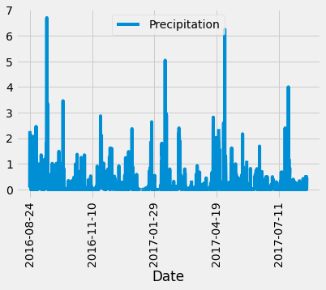

# SQLAlchemy Homework - Surfs Up!

## Step 1 - Climate Analysis and Exploration

Here Python and SQLAlchemy is used to do basic climate analysis and data exploration from climate database. All of the following analysis is completed using SQLAlchemy ORM queries, Pandas, and Matplotlib.

* SQLAlchemy `create_engine` is initiated to connect to your sqlite database.

* SQLAlchemy `automap_base()` is used to reflect your tables into classes and save a reference to those classes called `Station` and `Measurement`.

* Linked Python to the database by creating a SQLAlchemy session. Below are the image of analysis performed.

### Precipitation Analysis

* Here the most recent date in the data set is retrieved by creating a query .

* Then using this date, the average precipitation per day for the previous 12 months is retrieved by performing a query search. 

* Query results are stored into a Pandas DataFrame and set the index to the date column. And results are ploted

* The summary statistics for the precipitation data is calculated using pandas.

### Station Analysis

* Here query is performed to calculate the total number of stations in the dataset .

* Design a query that lists all stations with their corresponding observation count in descending order (observation count corresponds to the number of rows per station).

* The station id with the most active (i.e., has the greatest number of observations) is retrieved.

* The lowest, highest, and average temperature for that station id (i.e., the one with the greatest number of observations) is calcualted through the query.

* A query to retrieve the last 12 months of temperature observation data (TOBS) for the most active station is performed.

  * The results as a histogram with `bins=12` is plotted.

    

- - -

## Step 2 - Climate App

Here a Flask API is designed based on the queries and routes are created.

### Routes

* Belowlist all routes.

* `/`

* `/api/v1.0/precipitation`

* `/api/v1.0/stations`

* `/api/v1.0/tobs`

* `/api/v1.0/<start>` and `/api/v1.0/<start>/<end>`

  * When given the start date only, min, max, and avg for all dates greater than and equal to the start date is caculated

  * When given the start and the end date,  the minimum, average, and maximum obvserved temperature for dates between the start and end date inclusive is retrieved through query.
  
  * Returns a JSONified dictionary of these minimum, maximum, and average temperatures.

## Bonus Analyses:

### Temperature Analysis I

* The average temperature in June and December at all stations across all available years in the dataset is queried. 

* Unpaired Independent t_test(aka two sample t_test) is performed on mutually exclusive groups to test the differnce is means.

* It is an unpaired t_test because it compares the means of different group of months(june vs december).

* p_value > 0.05 is considered statistically insignificant and difference in means occur by chance.

### Temperature Analysis II

* A function called `calc_temps` that will accept a start date and end date in the format `%Y-%m-%d`. The function returns the minimum, average, and maximum  temperatures for that range of dates.

* The `calc_temps` function to calculated the min, avg, and max temperatures for the trip using the matching dates from a previous year (i.e., use "2017-08-01").

### Daily Rainfall Average

* The rainfall per weather station using the previous year's matching dates is calculated by performing the table join.

*  The station, name, latitude, longitude, and elevation are retrieved.

### Daily Temperature Normals

* A function called `daily_normals`  returns the daily normals for a specific month and day. This date string is in the format `%m-%d`.

